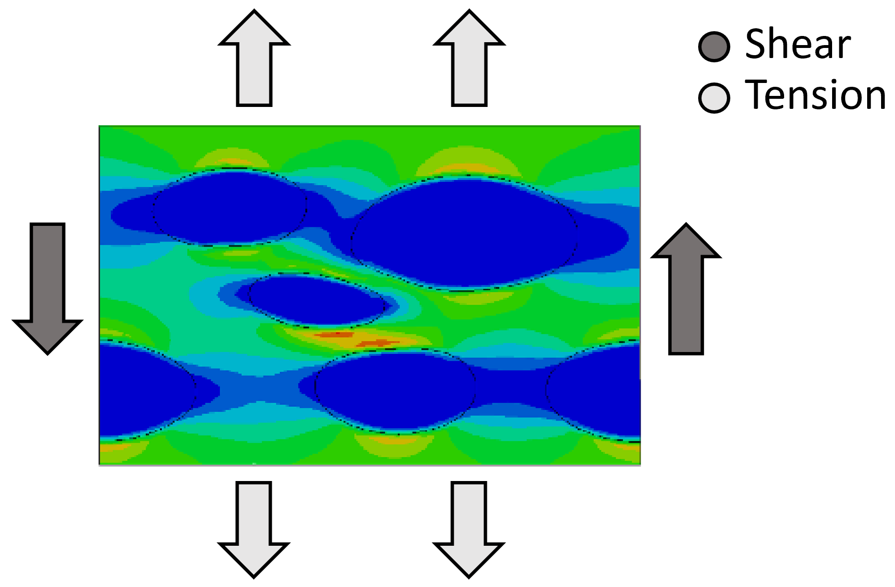

# Convergence Diagnostic via Data Analytics
The files in this repository demonstrates a workflow for gauging the convergence robustness of a finite element analysis (FEA) model before running a large time consuming model. TO understand the application, one would need moderate experience with FEA modeling for mechanical simulations. However, with the compiled data, data visualization and analysis is performed using python in Jupyter Notebooks. The test parameters were created using a Fractional Factorial Design. The primary model used is Support Vector Machine as a means to define if a model will converge. The Pandas library is used to clean and manage the dataset.

Clean-Compile-Data folder includes some scripts that take the multiple result files and extracts key metrics for the final analysis.
Analysis folder contains the cleaned data and Python script that perform the analysis.

## Motivation
In FEA, thermal and mechanical simulations can be run to predict deformations, stresses, and strains in a part. A non-linear analysis incorporates complex material models and geometries, which requires for the FEA code to "converge" on a solution. Convergence is dependent on time step, load case, material models, etc. When a solution does not converge, the model needs to be changed and re-run. These simulations can take hours or days to run, so re-running a case can delay engineering projects.

The intention of this project is to run a small FEA model multiple times with varying load cases and time steps and noting if the FEA model converged or not. From this information, we can train a classification model to predict if a model will converge given the applied loads.

## Results
The analysis demonstrated that SVM can be used to predict convergence to a reasonable degree of accuracy. Through a 5-fold cross validation, an accuracy of 78% was reached with a linear SVM classification model. The process and results are shown in 'Simulation_Data_Analysis.ipynb'
